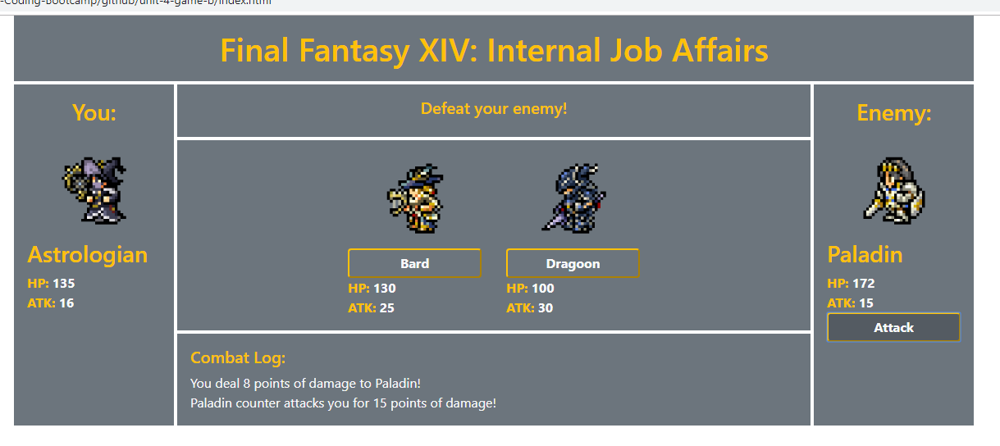

# RPG Game

## Summary
A game where the user picks a job and battle with the remaining jobs to claim superiority of jobs. Win by defeating all other jobs!

### **Functions:**
- Other jobs become selectable opponents after player chooses a job
- Game restart button appears when player loses or wins
- Jobs move to the grids representing player and opponent
- Opponents Attack changes to their counter value after player chooses a job
- Info panel updates to let player know what to do
- Combat Log shows extra info for comprehension

### **Balancing:**
- Show opponent counter values so player can strategize instead of guessing

## Site Picture


## Technologies Used
- HTML
- Bootstrap
- Javascript
- Git
- GitHub
- VSCode

## Links
Live Page: https://seiretsym.github.io/rpg-game<br>
Repo: https://github.com/seiretsym/rpg-game<br>
LinkedIn: https://www.linkedin.com/in/kerwinhy/<br>
GitHub: https://github.com/seiretsym<br>

## Code Snippet
```
$(document).ready(function() {
    $(".button").on("click", function() {
        // check if character is already selected
        if (!(characterSelected)) {
            selectCharacter(this.textContent);
        }
        else {
            if (!(enemySelected)) {
                selectEnemy(this.textContent);
            }
            else if (!(restartGame)) {
                changeInfo("Defeat your current enemy first!");
            }
        }
        // not sure why this only works when it's inside $(".button")
        $(".attack").on("click", function() {
            attackEnemy();

            // again not sure why this needs to be inside $(".attack")
            $(".restart").on("click", function() {
                newGame();
            })

        })
    })
```
